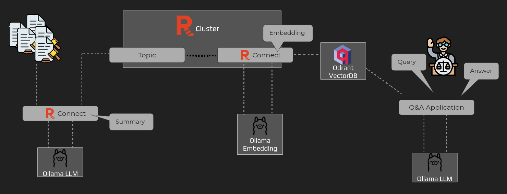
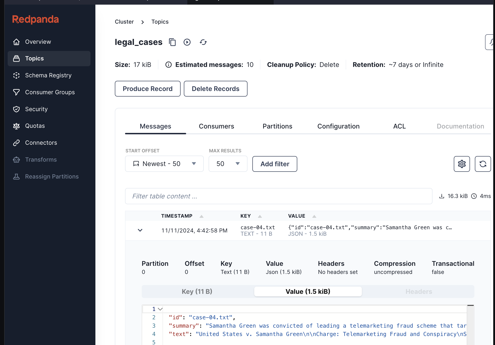

For organizations leveraging AI, the challenge often lies in efficiently processing and transforming unstructured data into usable formats for AI models.
Take the legal field, for example, where documents like court case files need to be summarized, tagged, and converted into embeddings before allowing similarity or semantic search and retrieval.

Redpanda Connect integrates with AI services to enable real-time AI-powered data processing, and this can be ran entirely within your own network (or offline if required).
This demo shows how to make use of local AI models to consume unstructured data and generate embeddings for fast, scalable and secure AI workflows.



You have five different tabs available, from left to right:
1. [button label="Terminal"](tab-0): This is the main tab for this demo, and where all commands below will be ran.
2. [button label="Editor"](tab-1): The editor will be used to view the Redpanda Connect pipelines we will run (and can also be used to view the docker compose script and court case files).
3. [button label="Console"](tab-2): Redpanda Console provides a nice visualization for the running cluster, along with various features for managing the cluster and the data it handles.
4. [button label="Qdrant"](tab-3): Qdrant is the vector database that will hold the embeddings for each court case.
5. [button label="Dashboard"](tab-4): This is a basic UI for asking questions related to the court cases.

To get started with Redpanda Connect and leverage its AI-powered data processing capabilities, follow these steps:

Ollama
===

Ollama is running with two models pulled and loaded. Run the following command for more details:

```bash,run
docker exec -i ollama ollama ls
```

Result:

```bash,nocopy
NAME                                                          ID              SIZE      MODIFIED
nomic-embed-text:latest                                       0a109f422b47    274 MB    4 seconds ago
llama3.2:latest                                               a80c4f17acd5    2.0 GB    About a minute ago
```

The llama3.2 model is the LLM that will be used for understanding natural language input, summarizing each court case, and return natural language results. The `nomic-embed-text` model is responsible for generating vector embeddings for each court case.

You can load any model from the [Ollama model repository](https://ollama.com/search). For example, if you wanted to load the `nomic-embed-chat` model you could run the following command:

```bash
docker exec -i ollama ollama pull nomic-embed-text
```

> Note: Both the llama3.2 and nomic-embed-text models should already be loaded, so the above command shouldn't be needed (it is provided as an example).

Qdrant
===

Qdrant is the vector database that will store the vector embeddings generated for each court case. Once qdrant obtains these vectors it will index the data in order to make it quick and easy to search.

Verify qdrant is running by opening the [button label="Qdrant"](tab-3) tab and clicking on "Collections" on the left navbar. At this point there should only be an empty `court-cases` collection.

Setup Redpanda
===

In the [button label="Terminal"](tab-0), run the following commands:

```bash,run
source ~/.bash_profile
cd workspace
```

Create the `legal_cases` topic:

 ```bash,run
rpk topic create legal_cases
```

Loading and summarizing court cases
===

In the [button label="Terminal"](tab-0), run the following command:

```bash,run
rpk connect run -e .rpenv legal-load.yaml
```

> Note: This step will take approximately 2 minutes to complete since we are running on a VM with limited resources and no GPU.

While the above command runs, select the [button label="Editor"](tab-1) and open the `legal-load.yaml` file. This pipeline reads all court cases, summarizes them, and then sends them to Redpanda.

- the `input` section uses a `file` component to load each court case file
- the `pipeline` section has multiple different processors:
  - `log`: aids in debugging and is optional
  - `mapping`: creates metadata (id and text) from the file path and content
  - `ollama_chat`: calls the local llama3.2 model to summarize the document
  - `mapping`: maps the summarized output into the root object
- the `output` section sends the summarized case data to the `legal_cases` via the `kafka_franz` component

> Note: Any changes to this file in the editor will be automatically saved.

Switch back to the [button label="Terminal"](tab-0) and wait for the command to complete. Then Verify the data is in the `legal_cases` topic using the [button label="Console"](tab-2) tab, and inspect the output to confirm cases includes `id`, `text`, and `summary`.



Generate vector embeddings and store in Qdrant
======

Select the [button label="Editor"](tab-1) and then open the `legal-converter.yaml` file. This pipeline reads data from Redpanda, generates the embeddings, and stores the results in Qdrant.

- the `input` section uses a `kafka_franz` component to consume data from the `legal_cases` topic
- the `pipeline` section has multiple different processors:
  - `mapping`: creates metadata (id and text) from the file path and content
  - the `branch` section enables branching across multiple child processors (but in this case it is only provided as an example and is not necessary)
    - `ollama_embeddings`: generates embeddings for each court case
    - `log`: aids in debugging and is optional
    - `result_map`: combines the output from each of the above processor components (`ollama_embeddings` in this case)
  - `catch`: if an error is thrown, the it is logged to standard out
- the `output` section sends the embeddings to the Qdrant vector database

In the [button label="Terminal"](tab-0), run the following command:

```bash,run
rpk connect run -e .rpenv legal-converter.yaml
```

Type `Ctrl+C` to exit the pipeline, then open the [button label="Qdrant"](tab-3) tab to see the entries.

Querying Court Cases
======

In the [button label="Dashboard"](tab-4) tab, paste any of the following questions:

```bash,copy
Are there any court cases involving money laundering?
```

```bash,copy
Which case has the longest prison sentence?
```

```bash,copy
Tell me about the case involving Emily White.
```

```bash,copy
Are any cases related to Chicago?
```

Come up with your own questions related to the court cases!

