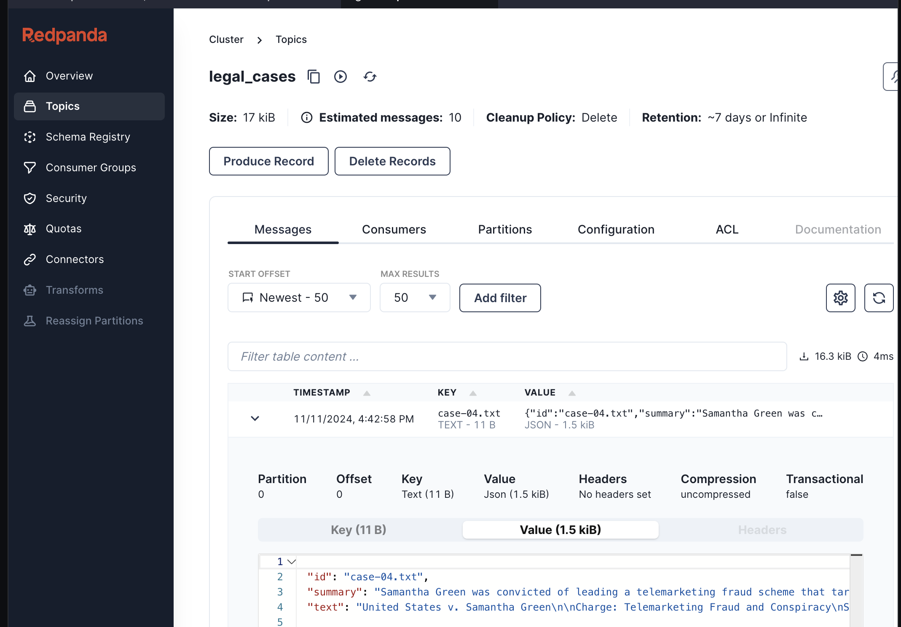

For organizations leveraging AI, the challenge often lies in efficiently processing and transforming unstructured data into usable formats for AI models. Take the legal field, for example, where documents like court case files need to be summarized, tagged, and converted into embeddings before allowing similarity or semantic search and retrieval. Redpanda Connect integrates with OpenAI and other AI services to enable real-time AI-powered data processing. It consumes unstructured data, transforming it via embedding models to generate embeddings for fast, scalable AI workflows.


Link to [video](https://youtu.be/4wgz0OjoYTo)

In the environment, there is aVM, you have access to it via terminal
- [button label="Redpanda"](tab-0), use to start local Redpanda cluster, and running the pipelines
- [button label="Editor"](tab-1), showing `Cloud CLI` in `Editor` mode the you may sometimes need to click the <span style="font-size:30px">&#8635;</span> icon in editor tabs to refresh the content
- [button label="Redpanda A"](tab-2), extra terminal to the VM. In case you need it.
- [button label="Redpanda Console"](tab-3), Redpanda console provide better visualization to the running cluster

To get started with Redpanda Connect and leverage its AI-powered data processing capabilities, follow these steps:

Setup Redpanda
===

In [button label="Redpanda"](tab-0)
```bash,run
source ~/.bash_profile
cd /root/streamfestworkshop
```

In [button label="Redpanda"](tab-0)
```bash,run
docker-compose up -d
```

Configure `rpk` profile to work with the Redpanda cluster,
 ```bash,run
rpk profile create local
rpk profile set kafka_api.brokers=redpanda:19092,redpanda:29092,redpanda:39092
rpk profile set admin_api.addresses=redpanda:19644,redpanda:29644,redpanda:39644
rpk profile use local
```

Create all the topics needed for the game, you'll be creating dedicate topic for each NPC and two main topic for interacting with the frontend application, one bonus topic for future expansion.
 ```bash,run
rpk topic create legal_cases
```

if you want to use [button label="Redpanda A"](tab-2), don't forget to set the path too.
```bash,run
source ~/.bash_profile
cd /root/streamfestworkshop
```

Save the  Redpanda server location in the .rpenv File
```bash,run
 echo RP_BOOTSTRAP_SERVER="redpanda:19092"  >> .rpenv
 ```

Setup OpenAI
=====

Create an OpenAI Account
- Go to [OpenAI’s website](https://openai.com/).
- Click on **Sign Up** in the top-right corner if you don’t have an account. Otherwise, click **Log In**.
- Follow the prompts to complete the sign-up or log-in process.

Generate an API Key
- Once logged in, click on your profile icon in the top-right corner.
- Select **API Keys** from the dropdown menu.
- Click **Create new secret key** and name your key (e.g., “Legal AI Project”).
- Copy the generated key and **store it securely**. You won’t be able to view it again, so paste it directly into your .env file or keep it in a secure document.

Save the API Key in the .rpenv File (Refresh the editor if you don't see the file using the circle arrow on top of the explorer window)
- Open your `.rpenv` file in the text  [button label="editor"](tab-1).
- Add your OpenAI API key:
```copy
OPENAI_API_KEY="your_openai_api_key"
```

Setup Pinecone
=====

 Setting Up and Signing Up for Pinecone
- Create a Pinecone Account
- Go to Pinecone’s [website](https://www.pinecone.io/).
- Click **Sign Up** in the top-right corner if you don’t have an account, or Log In if you do.
- Complete the sign-up process using your preferred method (email or single sign-on).

Access the Console and Create an Index
- Once logged in, click on **Console** from the navigation menu to access your dashboard.
- In the console, click **Create Index.**
- Provide a name for the index `court-case` and specify the dimensions to match the model output,  `1536` for OpenAI embeddings.
- Set the metric `cosine similarity`  based on the retrieval preferences.
- Click **Create**.

Get Your Pinecone API Key and Host
- In the console, go to **API Keys** in the sidebar.
- Click **Create API Key** and give it a name (e.g., “Legal AI Key”).
- Copy the **API key** and **host URL** displayed.


Save the Pinecone API Key and Host in the .rpenv File
- Open your `.rpenv` file and add the following lines, pasting in your Pinecone details:

```copy
PINECONE_API_KEY="your_pinecone_api_key"
PINECONE_HOST="your_pinecone_host_url"
```
> [!NOTE]
>  PINECONE_HOST field must be a FQDN not a URL, don't forget to remove the `https://` prefix


Write and Test the legal-load.yaml Configuration
===
- Open the ` legal-load.yaml` file in the text  [button label="editor"](tab-1).
- Add the Input Section:
	- This section scans the `court_cases` folder to read files for processing.
	- Add the following code snippet to start the file:
 ```yaml, copy
input:
  file:
    paths: [ ./court_cases/*.txt ]
    scanner:
      to_the_end: {}
```
1. **paths**: Specifies the directory to scan for .txt files. Adjust the path if necessary.
2. **scanner**: to_the_end: Configures the scanner to read files to their end.

- Write the Processors Section
	- The processors in this section will:
		- Log metadata for each document.
		- Generate metadata from file content.
		- Summarize the content with OpenAI’s language model.
- Add the following processors to legal-load.yaml:
```yaml, copy
pipeline:
  processors:
    - log:
        message: ${! meta() }
    - mapping: |
              meta id = meta("path").string().trim_prefix("court_cases/")
              meta text = content().string()
    - openai_chat_completion:
        server_address: https://api.openai.com/v1
        api_key: ${OPENAI_API_KEY}
        model: gpt-4o
        system_prompt: |
          Summarize the following court case in 3 sentences:
    - mapping: |
        root.id = meta("id")
        root.text = meta("text")
        root.summary = content().string()
    - log:
        message: \${! json() }
```

Explanation:
- log: Logs metadata and status messages to aid debugging.
- mapping: Creates metadata (id and text) from the file path and content.
- openai_chat_completion: Calls OpenAI’s model to summarize the document.
- Second mapping: Maps summarized output for final output.

Add the Output Section
This section sends summarized case data to the legal_cases topic in Redpanda.
Add the following to the end of legal-load.yaml:

```yaml, copy
output:
  kafka_franz:
    seed_brokers:
      -  ${RP_BOOTSTRAP_SERVER}
    topic: legal_cases
    compression: none
    key: ${! json("id") }
```

Save and Run the Full legal-load.yaml Pipeline
In  [button label="Redpanda"](tab-0) execute the command again to process files and send output to Redpanda:
```bash,run
rpk connect run -e .rpenv legal-load.yaml
```

Verify the data is in the legal_cases topic using Redpanda Console, and inspect the output, confirming that each case includes `id`, `text`, and `summary`.


Write and Test the legal-converter.yaml Configuration
======

Set up the ` legal-converter.yaml` to read data from Redpanda, generate embeddings, and store in Pinecone.
Open the `legal-converter.yaml` file in the text  [button label="editor"](tab-1).
- Write the Input Section to Consume from Redpanda
- Configure the input to consume messages from the legal_cases topic.

```yaml,copy
input:
  label: ""
  kafka_franz:
    seed_brokers:
      - ${RP_BOOTSTRAP_SERVER}
    topics:
      - legal_cases
    regexp_topics: false
    consumer_group: "legal-pipe"
```
Add the Processing Pipeline
This pipeline generates embeddings for each document, logs intermediate data, and prepares it for Pinecone, add the following processors:
```yaml,copy
pipeline:
  processors:
    - mapping: |
        meta doc = this
        meta summary = this.summary.string()
        meta key = meta("kafka_key").string()
    - log:
        message: ${! meta() }
    - branch:
        processors:
          - openai_embeddings:
              server_address: https://api.openai.com/v1
              api_key: ${OPENAI_API_KEY}
              model: text-embedding-3-small #1536 dimensions
        result_map: |-
          root.embeddings = this
          root.metadata = metadata("doc").string()
    - log:
        message: ${! json("embeddings") }
```
Explanation:
- branch: Executes OpenAI’s embedding API in a separate branch.
- log: Logs the embeddings and metadata for review.

Add the Output Section for Pinecone
The final step sends embeddings to Pinecone for semantic search, add the following code to `legal-converter.yaml`:
```yaml, copy
output:
  pinecone:
    max_in_flight: 64
    host: ${PINECONE_HOST}
    api_key: ${PINECONE_API_KEY}
    operation: upsert-vectors
    id: ${! metadata("kafka_key").string() }
    vector_mapping: embeddings
    metadata_mapping: |-
      root.summary = @.summary
      root.text = @.doc.string()
      root.timestamp = timestamp_unix()
```
Explanation:
- upsert-vectors: Adds or updates embeddings in Pinecone.
- metadata_mapping: Maps fields like summary and text for searchability.

Save and Run the Full legal-converter.yaml Pipeline
In In  [button label="Redpanda"](tab-0)  run the configuration to load data into Pinecone:
```bash,run
rpk connect run -e .rpenv legal-converter.yaml
```

Type `ctrl+C` to exit the pipeline, and check you see the new embedding entries in the Pinecone index.


Querying Court Cases
======
To query the court cases using the `query.py` script, follow these steps:
In [button label="Redpanda"](tab-0)
1. Make sure you the required environment variables from previous step.

2. Open a terminal or command prompt and navigate to the directory where the `query.py` script is located.

    ```bash,run
   cd /root/streamfestworkshop
	export $(grep -v '^#' .rpenv | xargs)
    python3 -m venv env
   source env/bin/activate
    pip install -r  requirements.txt
    ```
3. Run the following command to execute the script:

    ```bash,run
    python3 query.py
    ```
    ```bash,run
    Are there any scam use cases?
    ```

    This will initiate the query process and retrieve relevant information from the court cases.

4. Ask a few qustion around the court cases


Clean up
===
Type `ctrl+C` top stop query python application in [button label="Redpanda"](tab-0) and leave the virtual environment
```bash,run
deactivate
```
Clean up and shutdown Redpanda
```bash,run
cd /root/streamfestworkshop
rpk topic delete legal_cases
rpk profile delete local
docker-compose down
```
